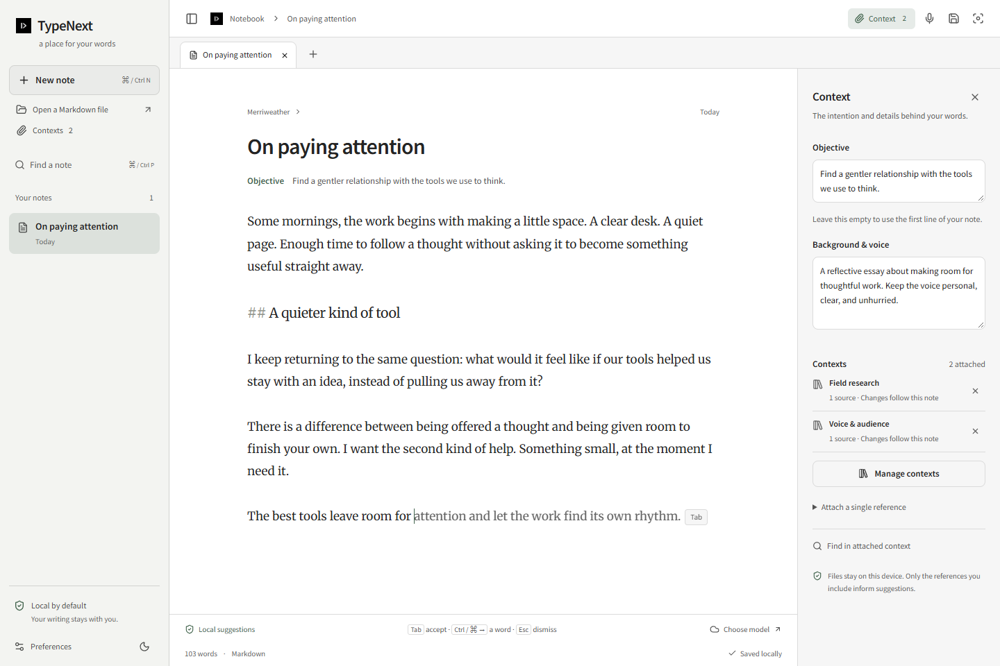
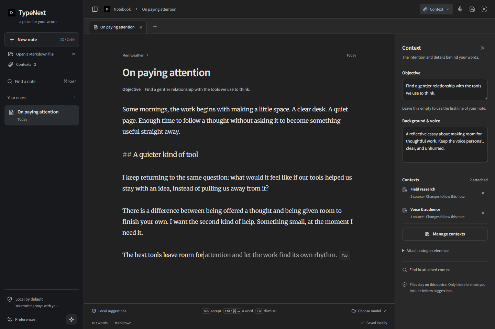
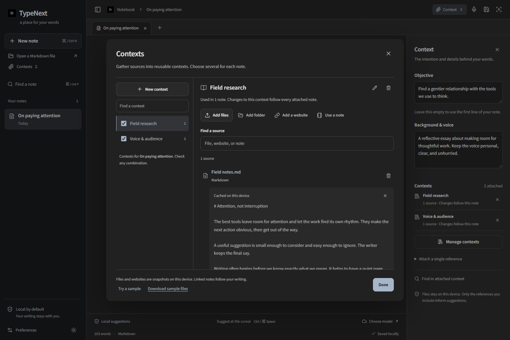
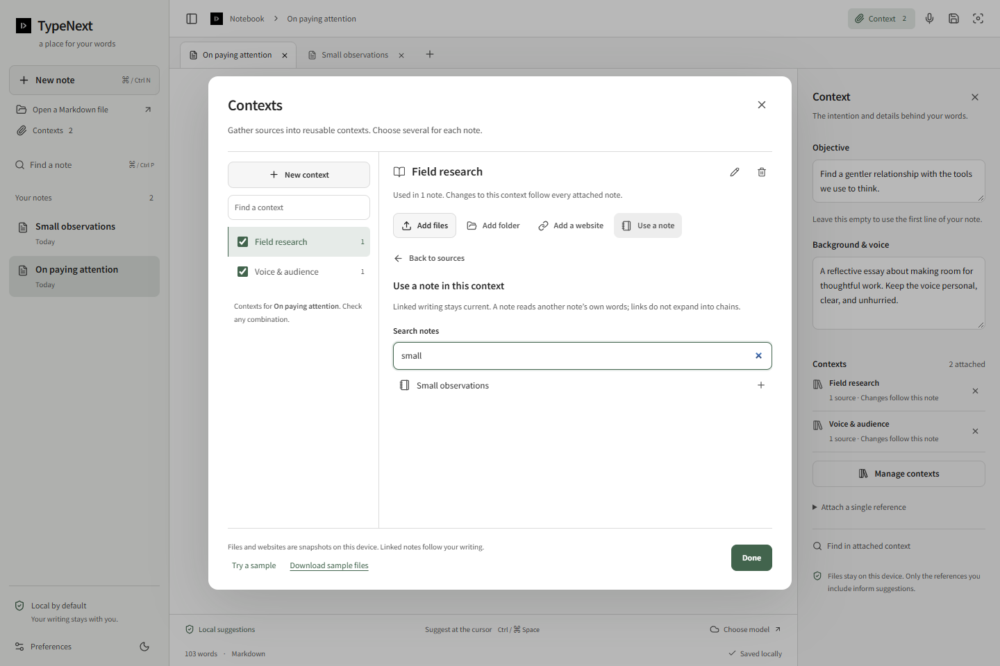
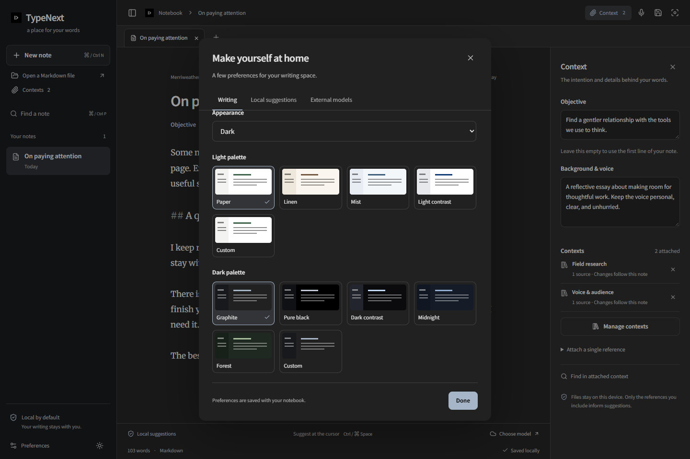
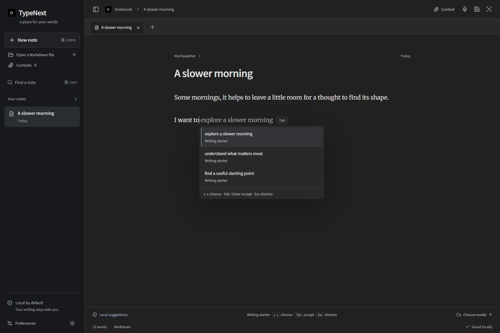
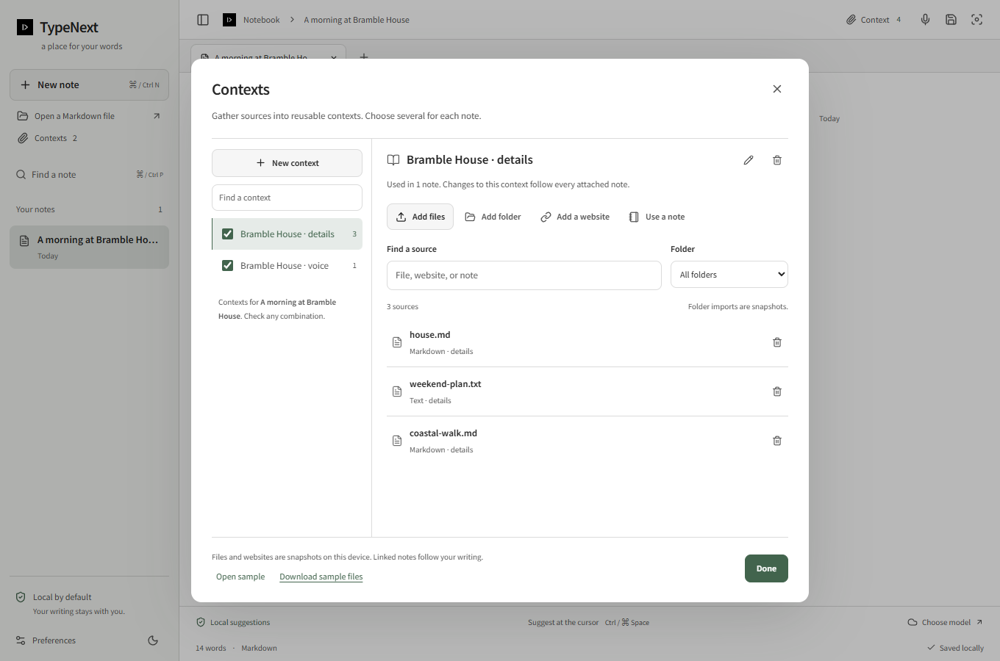
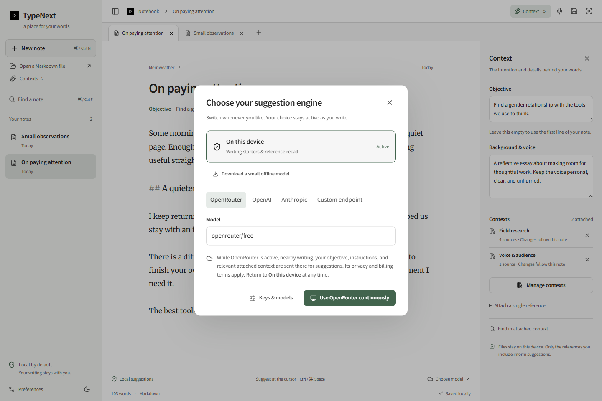
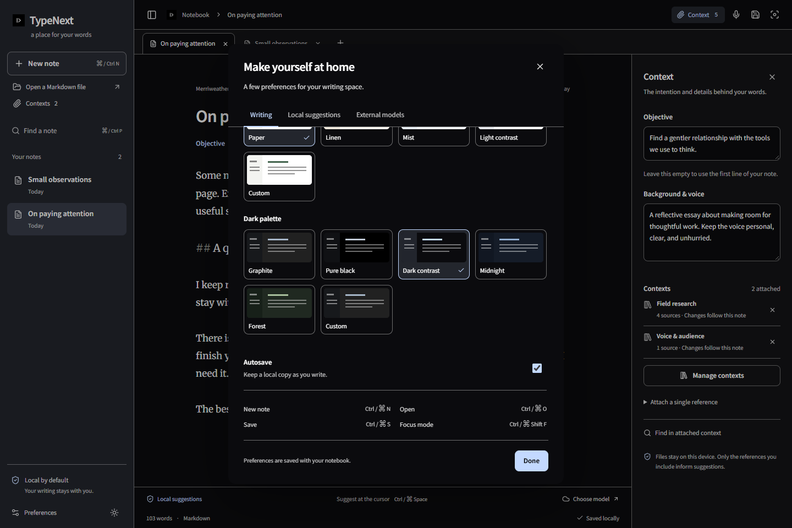
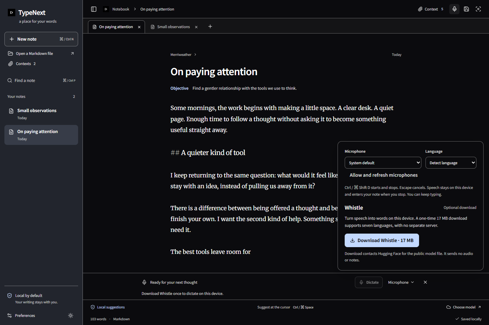

# TypeNext

A local-first Markdown notepad. Your thoughts lead; suggestions help you keep going.

[Download for Windows and macOS](https://github.com/alshell7/typenext/releases/latest).



TypeNext gives you a quiet page, a small notebook of tabs, and context close to your writing. A suggestion appears at the cursor. You decide whether it belongs.

## Writing

- Create a note with a title and a little background. Set an objective, or let the first line of the note provide it.
- Create named, reusable contexts in **Contexts**, then attach several to a note. Each context can hold folder snapshots, text, Markdown, searchable PDFs, DOCX files, websites and live note links. Shared text is stored once; a linked note's own writing stays current without copying it. Preview sources and choose which contexts each note uses.
- Accept a continuation with **Tab**, accept a word with **Ctrl/Command + Right**, or dismiss it with **Escape**. Accepted text can be undone normally.
- Press **Ctrl/Command + Space** for a small menu at the cursor. Use the arrow keys to preview a choice, then Enter or Tab to accept. Suggestions also work without attached references.
- Dictate inline with optional **Whistle**, a one-time 17 MB download. **Ctrl/Command + Shift + D** starts and stops; **Escape** cancels. Choose your microphone and language, speak while typing, and let the transcript enter the note when you stop. Automatic suggestions resume after insertion when enabled.
- Keep recent notes, switch tabs, use focus mode, and autosave locally. Open and save ordinary Markdown files.
- Choose light, dark, or system appearance. Start with paper or neutral graphite, choose Pure black, Dark contrast, Light contrast or another curated palette, or set your own page, sidebar, and accent colours. Change the writing typeface and size.

New notebooks start empty. Choose **Try a sample** on the welcome screen or in **Contexts** to open a fictional Bramble House retreat note with two attached context packages. Put the cursor after “Guests arrive at Bramble House”, press **Ctrl/Command + Space**, then **Tab**. The default local recall mode completes the arrival detail directly from the sample files, with no setup. You can edit the sample, switch models, or detach a context to compare.

The [sample files](examples/bramble-house) and [downloadable ZIP](public/demo/typenext-sample.zip) are included. Opening the sample preserves your existing notes and model settings. The screenshots use example writing.

Autosave keeps a recoverable previous version and saves during continuous typing. Desktop saves replace complete files atomically; interrupted or unreadable data is preserved for recovery. See [save and recovery behaviour](docs/reliability.md) for the tested guarantees and limits, and the [service](docs/services-resource-audit.md) and [editor](docs/editor-resource-audit.md) resource measurements.

<details>
<summary>Dark appearance and reference previews</summary>











</details>



## Suggestions and privacy

Suggestions start on your device. With no model connected, **local recall** can complete a matching phrase from enabled references or earlier writing. When there is no matching phrase, **writing starters** offer short, optional English prompts using the note's own context. These lightweight starters are labelled separately from model-generated continuations; they do not invent facts. Attached references are optional.

For new wording without another app, download the optional **SmolLM2-135M** model in **Preferences → Local suggestions**. The pinned, verified download is about 139 MB; later generation and cached loading work offline. It is a small experimental English writing model, so judge its suggestions before accepting them. You can also connect a local instruction model through LM Studio, Jan, Lemonade, or llama.cpp. The same local BM25 retrieval feeds the built-in model, local servers and deliberately enabled external models. Each request combines relevant attached passages with a bounded objective, background and cursor prefix/suffix. Native llama.cpp FIM is available for models trained for infill.

OpenRouter, OpenAI, Anthropic, and custom endpoints are optional. Configure their keys and saved models independently, then use **Choose model** beside the editor. **Use continuously** explicitly activates external suggestions until you switch back to **On this device**. The chooser explains what is shared; the active provider remains visible. No local error triggers an external fallback. OpenRouter defaults to its free-model router, and its available-model list can filter for free models. Availability and account limits still apply.

With an active hosted chat model, **Ctrl/Command + Space** asks for up to three fresh, distinct choices in one request. It refreshes the choices even at the same cursor. Arrow-key preview makes no further requests, and only the choice you accept enters the note. Local recall, writing starters and local models keep their offline paths.

Set your own suggestion instructions and choose a few words, one sentence, or an adaptive length. **Find in attached context** uses the same BM25 retriever to search your attached sources. Suggestions prioritize the words near the cursor. Retrieval is lexical: it finds matching words rather than embedding-based semantic similarity. A model can still get a fact wrong despite receiving the right passage.

Notes and extracted references are stored locally. Desktop keys can be remembered in the operating system credential vault; otherwise they stay in the session. Browser keys are session-only. Website import contacts the selected website, and optional Firecrawl import sends its URL to Firecrawl. Files are parsed locally.

Both built-in models download only when requested. Whistle records and transcribes locally; microphone access starts only from a dictation or microphone-setup gesture. Recordings stop at 30 seconds, and captured audio is discarded after transcription or cancellation. Transcripts are inserted automatically at the recording position, which follows typing edits; an insertion failure keeps the transcript available to edit and recover. Dictated text uses the same suggestion mode as typed text, including an intentionally activated external provider. The text worker has bounded input/output, cancellation and idle unloading; downloaded weights are separate from notebook saves. Server models remain managed by your chosen server. Scanned PDFs need OCR, and legacy `.doc` files need conversion to `.docx` or text. The researched model/runtime choices and current boundaries are in [AI design](docs/ai-design.md).

<details>
<summary>Models, contrast themes, and dictation</summary>







</details>

Measured runtime limits and model provenance are in [built-in models](docs/builtin-models.md). The [prose FIM training recipe](docs/fim-training.md) includes a Colab-ready notebook; no custom-trained checkpoint is shipped.

## Development

Node.js **22.13 or later** (or 24+), stable Rust, and the [Tauri prerequisites](https://v2.tauri.app/start/prerequisites/) for your platform are required for desktop development. Linux also needs `libdbus-1-dev` for the credential vault.

```sh
npm ci
npm run tauri:dev
```

To work on the interface in a browser:

```sh
npm run dev
```

The browser preview uses local browser storage and session keys. Servers must permit browser CORS; the desktop app uses its native HTTP bridge.

```sh
npm run typecheck
npm run lint
npm run test:run
npm run test:e2e
cargo test --manifest-path src-tauri/Cargo.toml
npm run tauri:build
```

Browser tests use installed Edge on Windows or Playwright Chromium elsewhere. Install the latter with `npx playwright install --with-deps chromium` when needed. `npm run test:native:windows` builds a separate test profile and exercises the real Windows WebView and Rust bridge. Live provider tests are opt-in and use synthetic text; see [testing](docs/testing.md).

The active implementation is in `src/notebook`, `src/components/notebook`, and the notebook services. Earlier template code is preserved but excluded from the active TypeScript project and production bundle. `package-lock.json` is the canonical dependency lockfile.

## Project website

The static project site is in `site`. Build it with `npm run site:build`. The Pages workflow publishes only `site-dist` to the `github-pages` environment when changes reach `main`.

The intended deployment address is `https://alshell7.github.io/typenext/`. Publishing requires the GitHub repository and Pages access; a successful Pages workflow confirms that it is live.

## Contributing

Keep the writing flow small, keyboard-friendly, and understandable in the app. Changes to suggestions should test cursor movement, cancellation, suffix preservation, and the local/external privacy boundary. Changes to storage should preserve a recoverable copy and make failures visible.

TypeNext uses Tauri 2, React, TypeScript, CodeMirror 6, and a small local BM25 index. Source extraction uses PDF.js, Mammoth, and Mozilla Readability. See [third-party notices](docs/third-party.md) for bundled fonts and libraries.

## License

[MIT](LICENSE.md) for TypeNext-owned work. Bundled libraries, runtimes and fonts retain their upstream licenses; optional model weights are separate downloads. See the [licensing and provenance record](docs/licensing.md) and [complete third-party notices](public/notices/THIRD-PARTY-NOTICES.md).
